# n8n-nodes-discord

[n8n](https://www.n8n.io) nodes to trigger workflows from Discord or send interactive messages. Uses the components API which allows to create dialogs (e.g. attach buttons and wait for the user to click on them).

These nodes do not use webhooks but a Discord bot to enable two-way communication. The bot automatically launches into a main process once configured and transmits or receives data from child processes when a node is executed.

A video demo can be found [here](https://twitter.com/hckdotng/status/1583161864212865025).

## How to install

### Community Nodes (Recommended)

1. Go to **Settings > Community Nodes**.
2. Select **Install**.
3. Enter `n8n-nodes-discord` in **Enter npm package name**.
4. Agree to the [risks](https://docs.n8n.io/integrations/community-nodes/risks/) of using community nodes: select **I understand the risks of installing unverified code from a public source**.
5. Select **Install**.

After installing the node, you can use it like any other node. n8n displays the node in search results in the **Nodes** panel.

### Manual installation

To get started install the package in your n8n root directory:

`npm install n8n-nodes-discord`

For Docker-based deployments, add the following line before the font installation command in your [n8n Dockerfile](https://github.com/n8n-io/n8n/blob/master/docker/images/n8n/Dockerfile):

`RUN cd /usr/local/lib/node_modules/n8n && npm install n8n-nodes-discord`

## Bot setup

In order to send, listen to messages, get the list of channels or roles, you need to setup a bot using the [Discord Developer Portal](https://discord.com/developers/applications).

First, create an application by clicking on **New Application** in the [Developer Portal](https://discord.com/developers/applications).

Go to **OAuth2** and copy the client ID. On your n8n instance, you will create new Discord App credentials (**Credentials > New > Search for "Discord App" > Continue**) and paste the Client ID into the corresponding field. Don't close yet the modal.

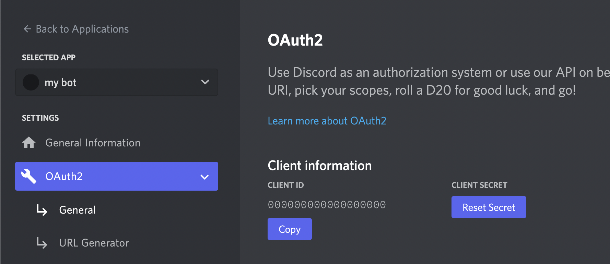

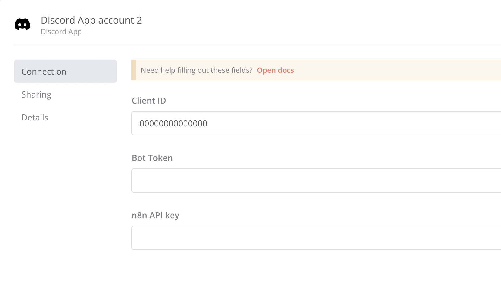

Get back to the Discord Developer Portal on your created application, go to **Bot** and click **Add Bot**. In the **Authorization Flow**, disable **Public Bot**. Activate all **Privileged Gateway Intents** then save your modifications.

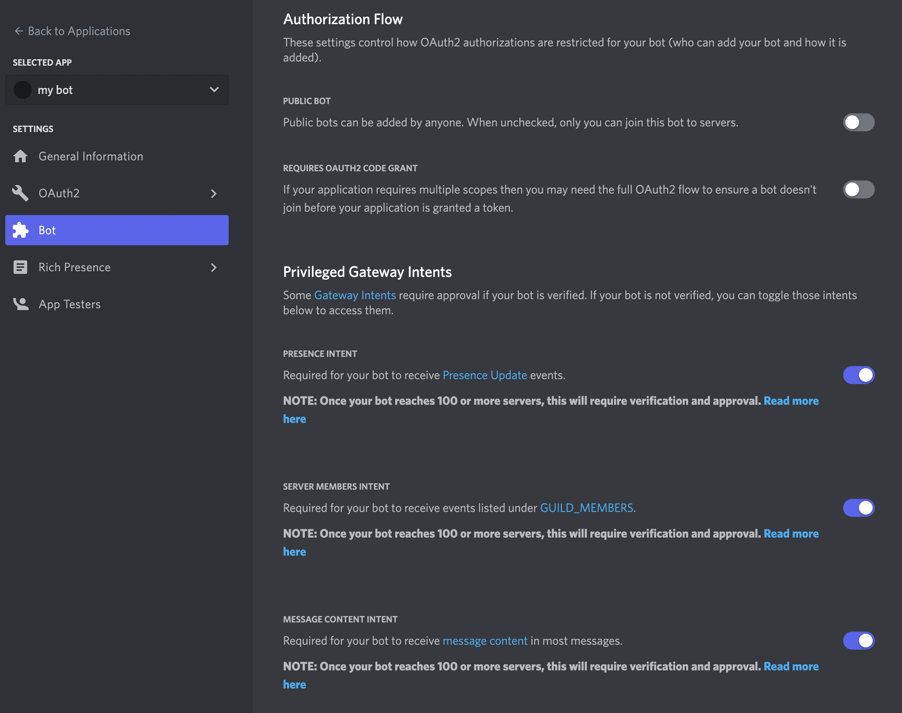

Go to **OAuth > URL Generator**, select the scopes **bot** and **applications.commands**, the bot permission **administrator** then copy the generated URL at the bottom.

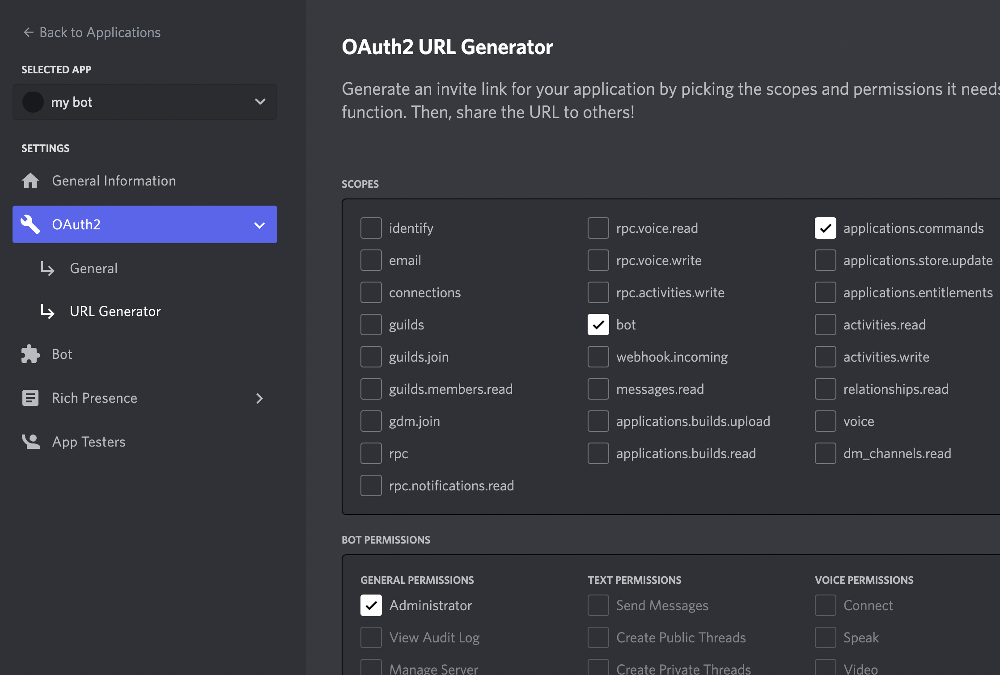

Now use this link to add the bot to your Discord server. You need to be logged in to Discord on the browser with the same account where you have **Manage Server** or **Administrator** permissions on the server you want to add the bot.

Once your bot is added to your server, you need to get the bot token and add it to your Discord App credentials. Just click on **Copy** on yout bot page or **Reset Token** if the button **Copy** is not visible.

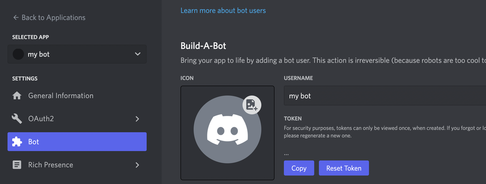

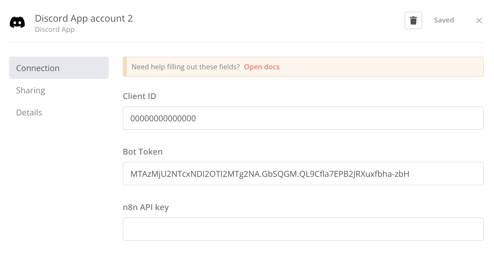

Save your credentials and got to **Settings > n8n API**, click **Create an API Key** or select the existing one, copy the key, reopen your Discord App credentials (**Credentials > Open**), paste the key into the **n8n API key** field and set your base URL (e.g. https://n8n.example.com/api/v1). Don't forget to save again.

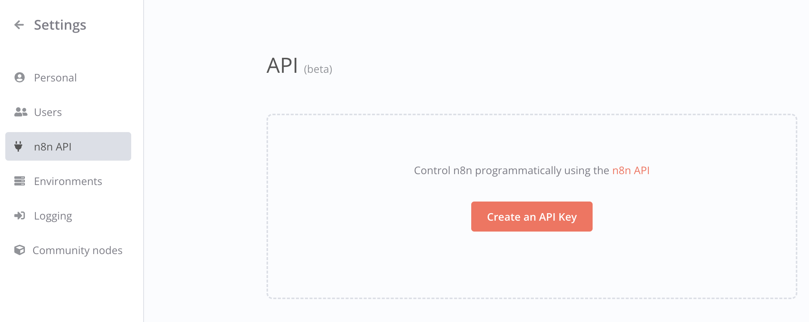

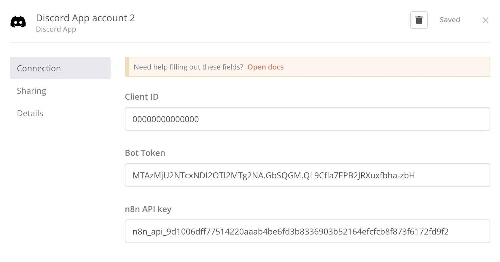

Now you will be able to use the **Discord Trigger** and **Discord Send** nodes on your workflows. The first time you setup one of these nodes, it will start the bot.

## Discord Trigger Node Reference

- **Credential for Discord App**: If you followed the bot setup guide above, you will be able to select your Discord App credentials to start the bot. If you are already another Discord Trigger (or Send) node, be careful to select the same credentials. It's not meant at the moment to be used with multiple Discord Server.
- **Listen to**: Let you select the text channels you want to listen to for triggering the workflow. Your credentials must be set and the bot running, you also need at least one text channel available. If you do not meet these requirements, make the changes then close and reopen the modal (the channels list is loaded when the modal opens). For triggers "user joins/leaves", use any channel to trigger the workflow, if you want to use a placeholder, select the channel where you want it displayed.
- **From roles**: The same logic apply here for roles, except it is optional. If you don't select any role it will listen to **@everyone**.
- **Trigger type**: Type of event to listen to.
  - **Message**: Listen to messages sent in the selected channels.
  - **User joins**: Listen to users joining the server.
  - **User leaves**: Listen to users leaving the server.
  - **User presence udpate**: Listen to users presence change.
  - **User role added**: Listen to users role added.
  - **User role removed**: Listen to users role removed.
- **Presence**: If trigger type presence update. Type of presence to listen to.
  - **Any change**: When a user presence is updated.
  - **Online**: When a user presence is set to online.
  - **Offline**: When a user presence is set to offline.
  - **Do not disturb**: When a user presence is set to do not disturb.
  - **Idle**: When a user presence is set to idle.
- **From roles**: When listening to user role update, select which removed or added role needs to be matched.
- **Pattern**: Message only. Select how the value below will be recognized. ⚠ Keep in mind that the value will be tested with all mentions removed and a trim applied (whitespaces removed at the beginning and at the end). For example `@bot hello` will be tested on `hello`.
  - **Equals**: Match the exact same value.
  - **Starts with**: Match the message beginning with the specified value.
  - **Contains**: Match the value in any position in the message.
  - **Ends with**: Match the message ending with the specified value.
  - **Regex**: Match the custom ECMAScript regex provided.
- **Value**: Message only. The value you will test on all messages listened to.
- **Case Sensitive**: Message only. Determine if it will be sensible to the case when matching the value.
- **Bot mention**: Message only. If true, a message will also need to mention the bot to trigger the workflow (this does not exclude the other criteria).
- **Placeholder**: The placeholder is a message that will appear in the channel that triggers the workflow. Three animated dots added to the placeholder indicate that the workflow is running. From a Discord Send node, you can set up a response message which will then take the place of this placeholder.

### Returned data

- **content**: The triggering message content (if type message).
- **channelId**: The triggering channel ID.
- **userId**: The triggering user ID.
- **userName**: The triggering username.
- **userTag**: The triggering user tag.
- **messageId**: The triggering message ID (if type message).
- **presence**: The triggering presence status (if type presence update).
- **addedRoles**: The triggering added role (if type role added).
- **removedRoles**: The triggering removed role (if type role removed).

## Discord Send Node Reference

- **Credential for Discord App**: If you followed the bot setup guide above, you will be able to select your Discord App credentials to start the bot. If you are already another Discord Trigger (or Send) node, be careful to select the same credentials. It's not meant at the moment to be used with multiple Discord Server.
- **Replace the trigger placeholder**: If active, the message produced by this node will replace the previous placeholder set. It can be a placeholder set by the Discord Trigger node or by another Discord Send node.
- **Send to the trigger channel**: If active, the message produced will be sent to the same channel were the workflow was triggered (but not replace the placeholder if there is one).
- **Send to**: Let you specify the text channels where you want to send the message. Your credentials must be set and the bot running, you also need at least one text channel available. If you do not meet these requirements, make the changes then close and reopen the modal (the channels list is loaded when the modal opens).
- **Type**: Let you choose the type of interaction you want to perform.

  - **Message**: This is the default type, it allows you to send a message without requiering any form of response.
    - **Content**: Displayed text message.
    - **Embed**: If active it will enable the creation of rich messages like this: 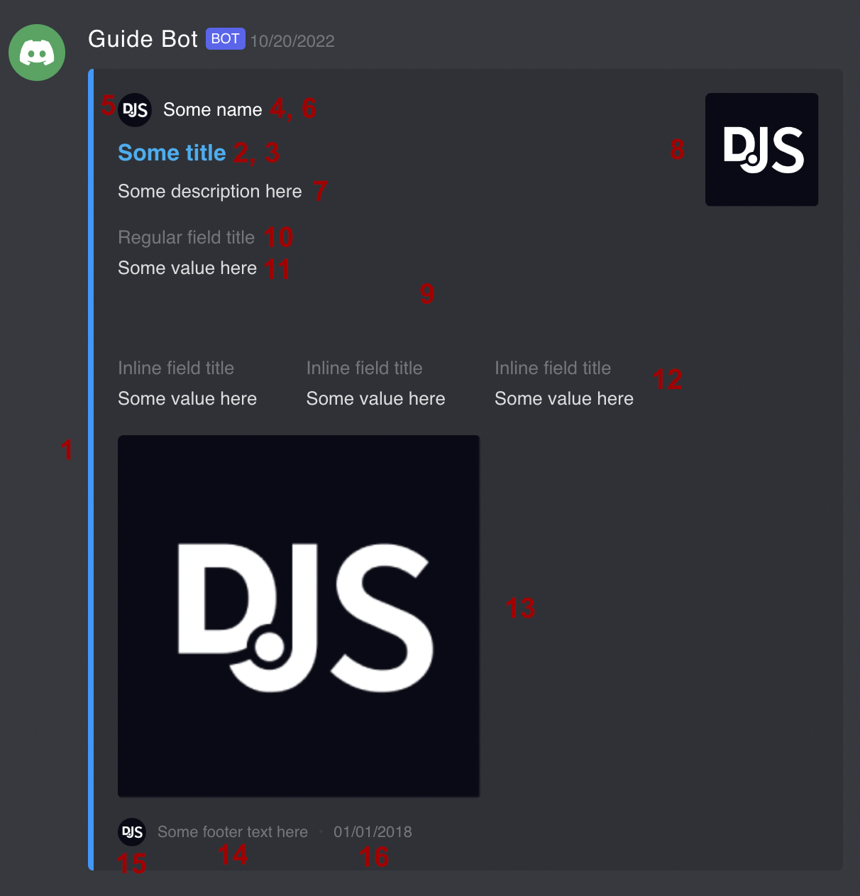
      - **Color** (1)
      - **Title** (2)
      - **URL** (3)
      - **Author name** (4)
      - **Author icon URL or base64** (5)
      - **Author URL** (6)
      - **Description** (7)
      - **Thumbnail URL or base64** (8)
      - **Fields** (9)
        - **Field**: If you add an empty field (no title/value) it will create a space in the embed.
          - **Title** (10)
          - **Value** (11)
          - **Inline** (12)
      - **Image URL or base64** (13)
      - **Footer text** (14)
      - **Footer icon URL or base64** (15)
      - **Displayed date** (16)
    - **Files**: Allows to attach up to 5 images to the message.
      - **URL or base64**: URL/base64 of the image to attach (png, jpg).
  - **Button Prompt**: It allows you to send an interactive dialog along with buttons users can click on. The workflow execution will wait untill someone answer.
    - **Content**: Displayed text message.
    - **Buttons**: Discord allows to add up to 5 buttons.
      - **Button**
        - **Label**: Displayed label on the button.
        - **Value**: Value returned by the node if clicked.
        - **Style**: You can choose between 4 different styles (primary, secondary, success, danger).
    - **Timeout**: Time (seconds) your workflow will wait until it passes to the next node (or stops the execution). The time left will be displayed and updated at the end of the text message. If the timeout is equal 0, it will wait indefinitely.
    - **Restrict to triggering user**: Only the user triggering the workflow will be able to interact (others will be ignored).
    - **Restrict to mentioned roles**: Only the user having one of the mentioned roles will be able to interact (others will be ignored).
  - **Select Prompt**: Same as button prompt, but it will display dropdown list instead of buttons.
    - **Content**: Displayed text message.
    - **Select**
      - **Option**
        - **Label**: Displayed label on the option.
        - **Description**: Optional displayed description.
        - **Value**: Value returned by the node if selected.
    - Other parameters are the same as for button prompt.
  - **Action**: Instead of sending a message, it will perform an action defined in the next field.
    - **Action**: Let you choose the type of action you want to perform. More types will be added in the future.
      - **Remove messages**: Remove last messages from the "send to" channel.
        - **How many?**: Number of last messages to remove (Discord API allow max 150 and messages < 4 weeks old).
- **Mention roles**: Let you specify roles you want to mention in the message. Your credentials must be set and the bot running, you also need at least one role (apart from @everyone) available. If you do not meet these requirements, make the changes then close and reopen the modal.
- **Placeholder**: Not available for simple messages. The placeholder is a message that will appear in the channel where the button or select prompt is displayed. Three animated dots added to the placeholder indicate that the workflow is running. From another Discord Send node, you can set up a response message which will then take the place of this placeholder.
- **Bot customizaion**: Active this option to customize the bot activity and status.
  - **Bot activity**: When you set a bot activity, it will be displayed in the "Now Playing" section of the bot profile. You need to refresh the activity periodically if you want to keep it.
  - **Bot activity type**: Let you customize the type of activity displayed on the bot profile.
  - **Bot status**: Let you customize the status of the bot (if a bot activity is also set).

### Returned data

- **value**: If type button/select prompt, return the value of the user selection.
- **channelId**: The channel ID where the message is sent.
- **userId**:  If type button/select prompt, return the ID of the interacting user.
- **userName**:  If type button/select prompt, return the username of the interacting user.
- **userTag**:  If type button/select prompt, return the tag of the interacting user.
- **messageId**: The ID of the sent message.
- **action**: If type action, return the action performed (at the moment the only available type is removeMessages).

## Commands

To help you create and debug your workflow with Discord Trigger/Send nodes, some commands have been registered to the bot.

- `/logs`: Display the last logs stored in memory (max 100).
  - **With parameters**
    - `/logs 10`: If you specify a number, it will display the number amount last logs.
    - `/logs clear`: Remove all logs in memory.
    - `/logs on`: Logs are automatically sent in the current channel.
    - `/logs off`: Disable logs automatically sent in the channel.
- `/clear`: Remove last (max 100) messages in the current channel.
  - **With parameters**
    - `/clear 10`: If you specify a number, it will remove the number amount last messages.
- `/test`: Toggle the test mode. Test mode switch the Discord bot on the trigger test url. Useful if you want to see how a workflow is executed and data are passed. Once the test mode is activated, go to the Discord Trigger UI and click on **Fetch Test Event** then on Discord send a message to trigger the workflow.
  - **With parameters**
    - `/test true`: Activate the test mode.
    - `/test false`: Disable the test mode.

## Screenshots

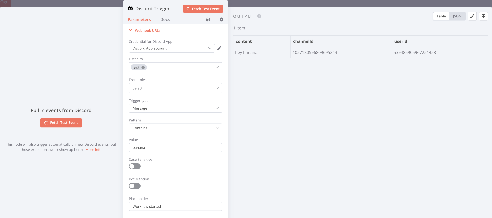

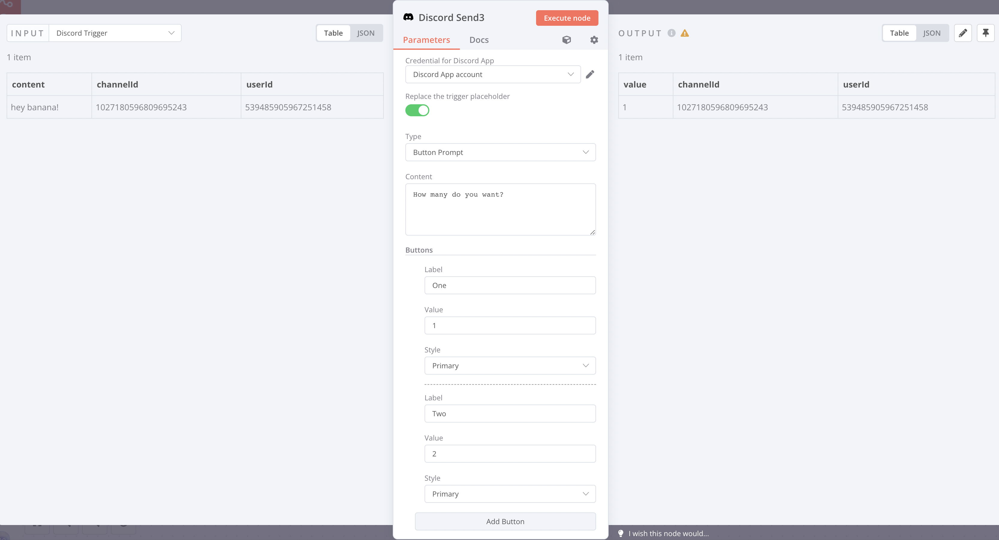

## License

MIT License

Copyright (c) 2022 hck.ng

Permission is hereby granted, free of charge, to any person obtaining a copy
of this software and associated documentation files (the "Software"), to deal
in the Software without restriction, including without limitation the rights
to use, copy, modify, merge, publish, distribute, sublicense, and/or sell
copies of the Software, and to permit persons to whom the Software is
furnished to do so, subject to the following conditions:

The above copyright notice and this permission notice shall be included in all
copies or substantial portions of the Software.

THE SOFTWARE IS PROVIDED "AS IS", WITHOUT WARRANTY OF ANY KIND, EXPRESS OR
IMPLIED, INCLUDING BUT NOT LIMITED TO THE WARRANTIES OF MERCHANTABILITY,
FITNESS FOR A PARTICULAR PURPOSE AND NONINFRINGEMENT. IN NO EVENT SHALL THE
AUTHORS OR COPYRIGHT HOLDERS BE LIABLE FOR ANY CLAIM, DAMAGES OR OTHER
LIABILITY, WHETHER IN AN ACTION OF CONTRACT, TORT OR OTHERWISE, ARISING FROM,
OUT OF OR IN CONNECTION WITH THE SOFTWARE OR THE USE OR OTHER DEALINGS IN THE
SOFTWARE.
